<architecture_analysis>
1) Komponenty i elementy z dokumentów (.ai/prd.md, .ai/auth-spec.md):
- Strony (Astro, SSR):
  - "/" (Welcome), "/auth/login", "/auth/register", "/auth/forgot-password", "/auth/change-password", "/auth/delete-account", "/app/*" (np. /app/generate)
  - Layout.astro (nagłówek: Login/Register vs Logout/Account)
  - Middleware SSR (context.locals: supabase, session, user; ochrona tras)
- Komponenty React (formularze):
  - LoginForm.tsx, RegisterForm.tsx, ForgotPasswordForm.tsx, ChangePasswordForm.tsx, DeleteAccountConfirm.tsx
- API (Astro API routes):
  - POST /api/auth/register | login | logout | password/change | password/forgot | account/delete
- Serwisy/Lib:
  - Supabase server client (cookies) • Supabase Auth • EmailService • UserDataService
  - Walidacje: src/lib/validation/auth.schemas.ts (client), src/lib/validation/auth.server.schemas.ts (server)
  - HTTP wrapper: src/lib/services/http.ts
- Stan/bezpieczeństwo:
  - Astro.locals.user (SSR), cookies sesji Supabase, RLS w DB, redirecty po login/logout

2) Główne strony i odpowiadające komponenty:
- / (Welcome) → CTA do /auth/login, /auth/register; warunkowy redirect do /app/generate gdy user
- /auth/login → LoginForm.tsx
- /auth/register → RegisterForm.tsx
- /auth/forgot-password → ForgotPasswordForm.tsx
- /auth/change-password → ChangePasswordForm.tsx (wymaga user)
- /auth/delete-account → DeleteAccountConfirm.tsx (wymaga user)
- /app/* (np. /app/generate) → chronione middleware

3) Przepływ danych:
- Formularze React → fetch JSON → /api/auth/* → Supabase Auth (server client, cookies) → aktualizacja sesji → redirect (SSR/klient)
- Middleware SSR → w każdej odpowiedzi odczyt sesji z cookies → ustawia Astro.locals.{supabase, session, user} → ochrony i redirecty
- Layout.astro korzysta z Astro.locals.user do renderowania akcji w top barze

4) Krótki opis komponentów:
- Middleware SSR: inicjuje Supabase server client, wstrzykuje user i egzekwuje ochronę tras (/app/*, change/delete)
- Layout.astro: nagłówek z Login/Register lub Logout/Account; reaguje na user w SSR
- Strony auth (Astro): SSR + mount punkt dla formularzy React
- Formularze React: walidacja (zod), stany ładowania/błędów, wysyłka do API
- API /api/auth/*: walidacja wejścia, wywołania Supabase (signUp/signIn/signOut/updateUser/admin), mapowanie błędów
- EmailService: wysyłka linku resetu lub generowanego hasła (tryb 2)
- UserDataService: usunięcie danych domenowych przy delete account

```mermaid
flowchart TD
  %% Układ główny
  direction TB

  %% Klasy stylów
  classDef updated fill:#fff3cd,stroke:#b38b00,stroke-width:1px;
  classDef api fill:#e7f5ff,stroke:#1971c2,stroke-width:1px;
  classDef react fill:#f3f0ff,stroke:#5f3dc4,stroke-width:1px;
  classDef ssr fill:#ecfdf5,stroke:#0f766e,stroke-width:1px;
  classDef ext fill:#ffe8e8,stroke:#c92a2a,stroke-width:1px;

  %% Warstwa SSR Astro
  subgraph SSR["Warstwa SSR (Astro)"]
    MW["Middleware SSR<br/>(context.locals: supabase, session, user)<br/>Ochrona tras"]:::ssr
    LAYOUT["Layout.astro<br/>(Top bar: Login/Register vs Logout/Account)"]:::ssr
    INDEX["Strona Główna /<br/>warunkowy redirect jeśli zalogowany"]:::ssr
    PROT["Strony chronione /app/*<br/>(np. /app/generate)"]:::ssr

    AL["/auth/login (Astro)"]:::ssr
    AR["/auth/register (Astro)"]:::ssr
    AF["/auth/forgot-password (Astro)"]:::ssr
    AC["/auth/change-password (Astro)"]:::ssr
    AD["/auth/delete-account (Astro)"]:::ssr
  end

  %% Komponenty React formularze
  subgraph REACT["Komponenty React (Auth Forms)"]
    F_LOGIN[LoginForm.tsx]:::react
    F_REG[RegisterForm.tsx]:::react
    F_FORG[ForgotPasswordForm.tsx]:::react
    F_CHG[ChangePasswordForm.tsx]:::react
    F_DEL[DeleteAccountConfirm.tsx]:::react

    subgraph FE_LIB["Lib (frontend)"]
      ZOD["src/lib/validation/auth.schemas.ts"]:::react
      HTTP["src/lib/services/http.ts"]:::react
    end
  end

  %% API Auth Astro API routes
  subgraph API["API Autentykacji (Astro API routes)"]
    API_REG["API Register (POST)"]:::api
    API_LOG["API Login (POST)"]:::api
    API_OUT["API Logout (POST)"]:::api
    API_PCH["API Password Change (POST)"]:::api
    API_PFO["API Password Forgot (POST)"]:::api
    API_DEL["API Account Delete (POST)"]:::api
  end

  %% Usługi serwerowe i Supabase
  subgraph SRV["Warstwa serwerowa i integracje"]
    SB_SRV["Supabase Server Client<br/>(cookies)"]:::ssr
    SB_AUTH["Supabase Auth<br/>(users, sessions, RLS)"]:::ext
    EMAIL["EmailService (SMTP)"]:::ssr
    UDATA["UserDataService"]:::ssr
    STATE["Astro.locals.user<br/>(stan sesji SSR)"]:::ssr
  end

  %% Montowanie formularzy na stronach Astro
  AL -->|mount| F_LOGIN
  AR -->|mount| F_REG
  AF -->|mount| F_FORG
  AC -->|mount| F_CHG
  AD -->|mount| F_DEL

  %% Walidacje i HTTP wrapper
  F_LOGIN -.walidacja.-> ZOD
  F_REG -.walidacja.-> ZOD
  F_FORG -.walidacja.-> ZOD
  F_CHG -.walidacja.-> ZOD
  F_DEL -.walidacja.-> ZOD

  F_LOGIN -.fetch JSON.-> HTTP
  F_REG -.fetch JSON.-> HTTP
  F_FORG -.fetch JSON.-> HTTP
  F_CHG -.fetch JSON.-> HTTP
  F_DEL -.fetch JSON.-> HTTP

  %% Wywołania API
  HTTP -->|POST| API_LOG
  HTTP -->|POST| API_REG
  HTTP -->|POST| API_PFO
  HTTP -->|POST| API_PCH
  HTTP -->|POST| API_DEL
  LAYOUT -.Logout action.-> API_OUT

  %% API Supabase i efekty
  API_LOG -->|signInWithPassword| SB_SRV
  API_REG -->|signUp| SB_SRV
  API_OUT -->|signOut| SB_SRV
  API_PCH -->|updateUser password| SB_SRV
  API_PFO -->|reset link admin set| SB_SRV
  API_DEL -->|delete user dane| SB_SRV

  SB_SRV --> SB_AUTH
  SB_SRV -->|ustaw czytaj cookies sesji| MW

  %% Middleware i stan użytkownika
  MW -->|odczyt sesji| SB_SRV
  MW -->|ustaw Astro.locals.user| STATE
  STATE --> LAYOUT

  %% Ochrona tras i nawigacja
  MW -->|app bez user redirect| AL
  INDEX -->|zalogowany 302| PROT
  INDEX -->|niezalogowany Welcome| LAYOUT
  API_LOG ==>|sukces 302 app generate| PROT
  API_OUT ==>|sukces 302| INDEX

  %% Usuwanie konta domena auth
  API_DEL -->|deleteAllForUser| UDATA
  API_DEL -->|admin deleteUser| SB_SRV

  %% E-maile resetu hasła
  API_PFO -.może wysłać.-> EMAIL

  %% Zależności między warstwami
  LAYOUT --- MW
  AL --- LAYOUT
  AR --- LAYOUT
  AF --- LAYOUT
  AC --- LAYOUT
  AD --- LAYOUT

  %% Oznaczenie elementów zaktualizowanych
  class MW,LAYOUT,INDEX updated
```

</architecture_analysis>

<mermaid_diagram>

</mermaid_diagram>

